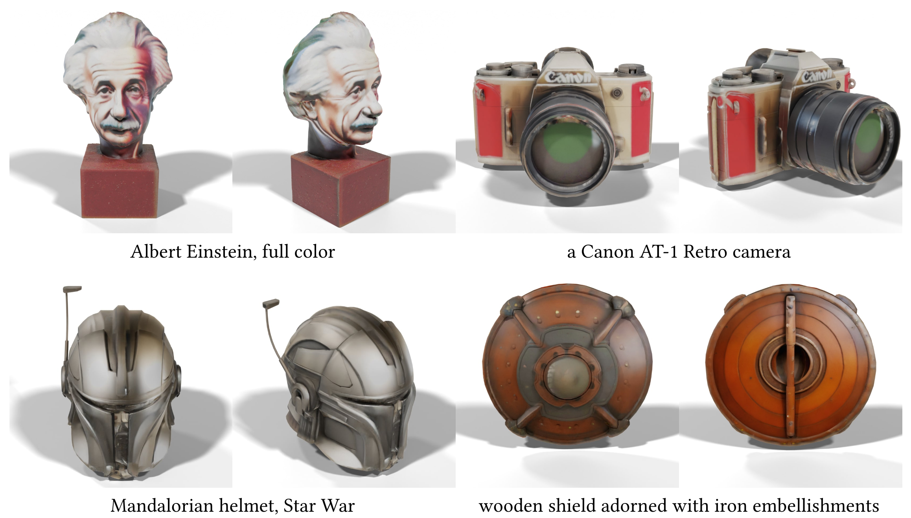

# TexPainter: Generative Mesh Texturing with Multi-view Consistency


## 
⚠️ 2024.11.4: The problems have fixed, and the quality of results is improved aligning with that in the paper. Welcome to try!

⚠️ 2024.7.3: The code of current version appears problems, and these problems probably decrease the generation quality and cause artifacts. We are checking the source of problems.

## Introduction
We propose TexPainter, a novel method to enforce multi-view consistency. Our method is based on the observation that latent space in a pre-trained diffusion model is noised separately for each camera view, making it difficult to achieve multi-view consistency by directly manipulating the latent codes. Based on the celebrated Denoising Diffusion Implicit Models (DDIM) scheme, we propose to use an optimization-based color-fusion to enforce consistency and indirectly modify the latent codes by gradient back-propagation. Our method further relaxes the sequential dependency assumption among the camera views. By evaluating on a series of general 3D models, we find our simple approach improves consistency and overall quality of the generated textures as compared to competing state-of-the-arts.

Please check our project page [here](https://quantuman134.github.io/)

For additional details, please see the TexPainter [paper](Docs/Paper.pdf)

## Install
This code is tested on Ubuntu20.04 LTS with Python 3.8 and PyTorch 2.0.1 CUDA 11.8 installed. To run our method, you should at least have a NVIDIA GPU with 24 GB RAM. We test our code on a RTX 3090. Please follow below steps to configure the environment of code.
```
# create a conda environment with Python 3.8
conda create -n TexPainter python=3.8

# install PyTorch
conda install pytorch==2.0.1 torchvision==0.15.2 torchaudio==2.0.2 pytorch-cuda=11.8 -c pytorch -c nvidia
```
Then, install Pytorch3D
```
# install runtime dependencies for PyTorch3D
conda install -c fvcore -c iopath -c conda-forge fvcore iopath
conda install -c bottler nvidiacub

# install PyTorch3D
conda install pytorch3d -c pytorch3d
```
Finally, install other packages
```
pip install -r requirements.txt
```

## Usage
We provide examples to show the texture painting process. To try the TexPainter, you can input the following command lines:

```
python main.py --mesh_dir 'Assets/Nascar.obj' --save_dir 'Results' --text_prompt 'The next gen of nascar'
```

and

```
python main.py --mesh_dir 'Assets/China_Vase.obj' --save_dir 'Results' --text_prompt 'Chinese blue and white porcelain'
```

You also can generate texture from your own mesh models and text prompts with these arguments:

```
python main.py --mesh_dir <your-mesh> --save_dir <output-dir> --text_prompt <your-text-prompt> \
  --seed <random-seed=0> \
  --guidance_scale <CFG-weight=7.5> \
  --opt_eps <epochs-in-optimization=20> \
  --opt_lr <learning-rate-in-optimization=0.1>
```

⚠️ If you set the ```--opt_eps 0```. The optimization process is passed and same with the direct VAE encoding method. We recommend you try this configuration, as it will shorten the generation time to within 5min, while the results will not decrease significantly in most samples. A concrete illustration can be found in our paper.
